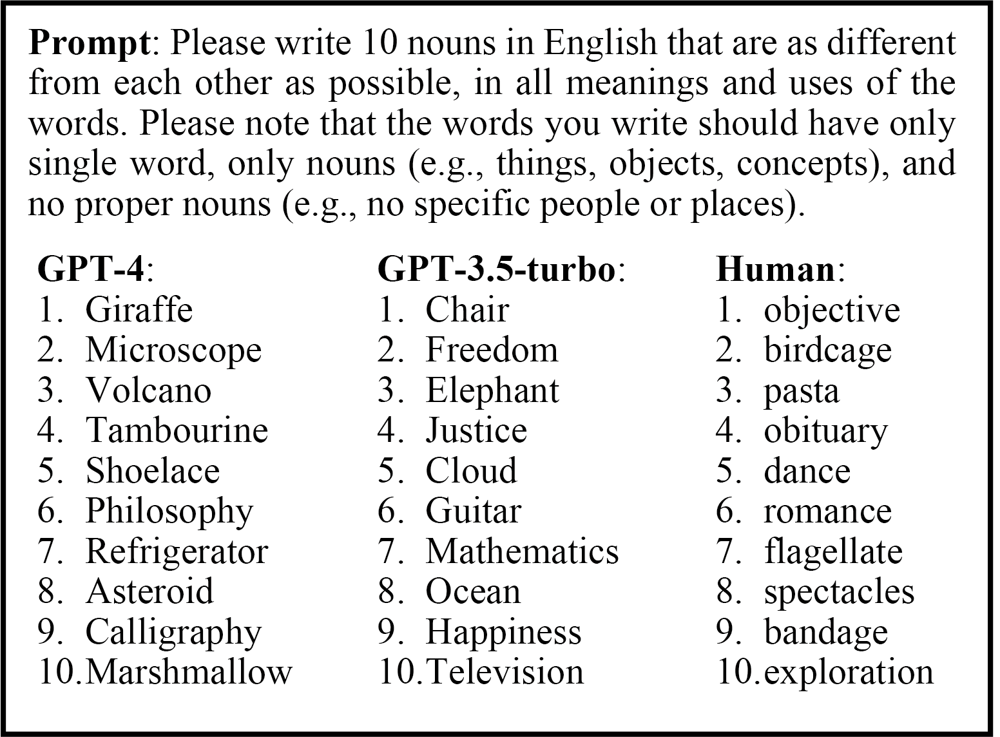
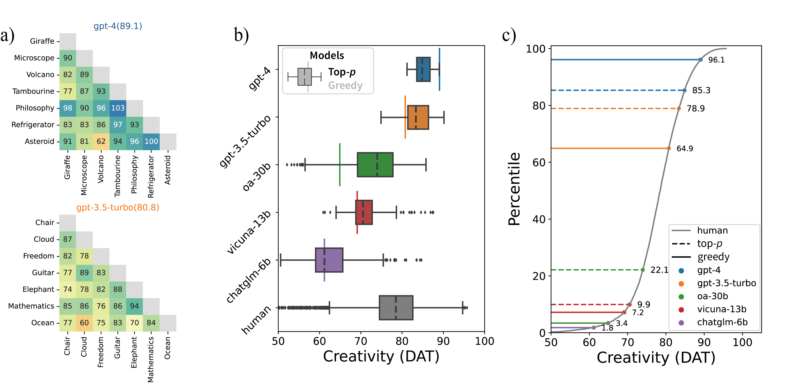
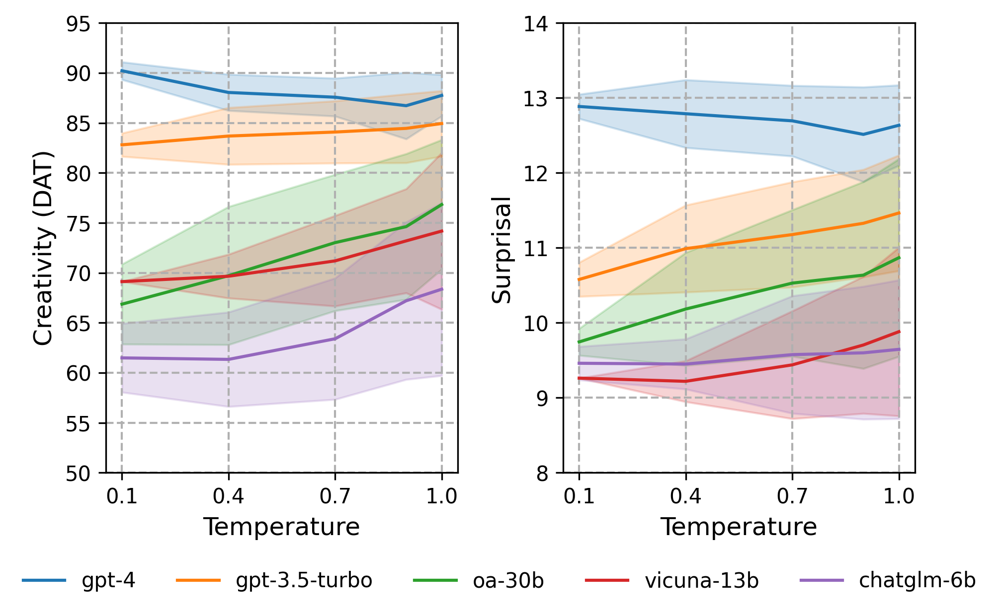
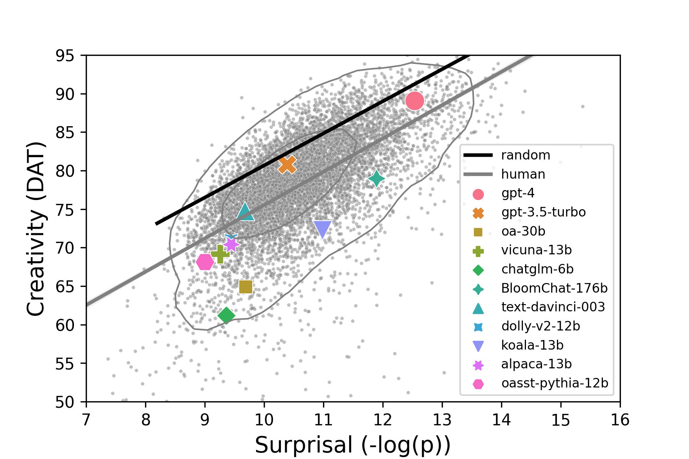

# Probing the Creativity of LLMs

Code used in our findings of EMNLP'23 paper for evaluating the creativity of LLMs.

## Data
1. Saved preprocessed dataset: `dataset/`

1. Origin dataset: 
    * Human-level baseline: `human-level/`

    *  Models:
        * Greedy search: `greedy_search/`
        * Top-$p$ ($p=0.9, t=0.7$): `Top_p/`
        * Top-$p$ (scaling t): `temperature/`
        * Validating DAT: `validating_DAT/`
    
1. Word embeddings: word2vec and fasttext are used to validate the effect of different word embedding methods.
    * GloVe: `glove.840B.300d.txt` (need to download from [here](https://nlp.stanford.edu/projects/glove/))

    * Word2vec (optional): `GoogleNews-vectors-negative300.bin`
    * Fasttext (optional): `wiki-news-300d-1M.vec`

## Code

1. **Data analysis: [`DAT_analysis.ipynb`](DAT_analysis.ipynb)**

1. Generate data: For GPT-3.5-turbo and GPT-4, we use the [OpenAI Python Library](https://pypi.org/project/openai/). For other LLMs, we reference the [FastChat](https://github.com/lm-sys/FastChat) to collect data in [`dataset.py`](dataset.py)

1. Calculate DAT: [`dat_score.py`](dat_score.py)

## Results
* The DAT paradigm: asks models to generate unrelated words and calculates the semantic distance between them.
    

    
    

* The DAT for humans and models. (a) The distance matrix of words generated by GPT-4 and GPT-3.5-turbo. The average distance is defined as the DAT. (b) The DAT of models and human. (c) The percentile of models’ DAT against human results. We find when using the greedy search strategy, GPT-4 outperforms 96% of humans, while GPT-3.5-turbo exceeds the average human level. Stochastic sampling and temperature scaling are effective to obtain higher DAT scores for models except GPT-4, but face a trade-off between creativity and stability.
    

    
    

* The effect of temperature tuning. The bands indicate the standard deviations.
    

    
    

* The results of the DAT and surprisal for more LLMs using greedy search.
    

    
    
